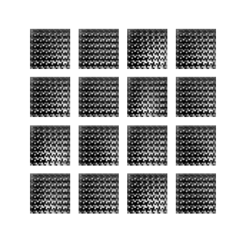
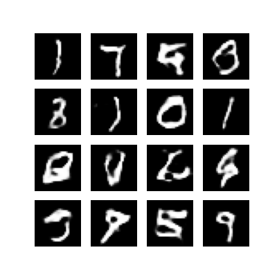
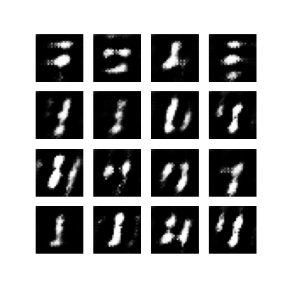

# Data Augmentation using GANs

## Data Preprocessing

For this project, I ended up using the **MNIST dataset** because it is a classic data set in the machine learning world. It contains small 28x28 pixel images of handwritten digits from 0 to 9. Before starting on training the model, I had to do a bit of preprocessing on the data. This mainly involved scaling the pixel values of the images from their original range of [0, 255] down to between [-1, 1]. It might seem like a small step, but it's a crucial one. This scaling helped the model learn more effectively and also aligned with the tanh activation function used in the generator part of the GAN since it outputs values in the range [-1, 1].

## Selection, Training, and Use of a Machine Learning Model

For this project, I used a type of **Generative Adversarial Network (GAN)** called a `Deep Convolutional GAN (DCGAN)`, which is known to be effective for image generation tasks. This is especially important for this project, as the goal was to generate images of handwritten digits to augment a hypothetical dataset. 

The model was split into two major parts: a generator, which creates new images, and a discriminator, which differentiates between real and synthetic images. The generator and discriminator were built with convolutional layers, a hallmark of DCGANs. This allowed the model to learn the spatial hierarchies in the images, which is important for image generation tasks. The generator also employed batch normalization for stable and efficient training.

In the training process, the generator and discriminator were in constant competition. As I explained in my presentation of GANs, this competition drove the model to improve. The generator tried to create convincing images while the discriminator learned to identify the fakes. This dynamic improved the performance of both components over time.
Something I had to consider when training the model was the stability of the training process. GANs are notoriously difficult to train, and I had to make some design decisions to ensure that the model would learn effectively. One of these decisions was to use the Adam optimizer, which is known to be effective for GANs. To further add stability to the training, I applied spectral normalization to the discriminator, a technique not typically found in standard DCGANs. This helped to control the discriminator, preventing it from overpowering the generator, and instead helped promote stable training.

I trained the model for **200 epochs**, which took about 30 minutes on Google Colab. I saved images from the generator after each epoch, which allowed me to see the progress of the model over time. Throughout this period, the generator's capability to create images resembling real handwritten digits increased significantly, showcasing the power of GANs in synthetic data generation. The success of the final model reflects the effectiveness of the design and training decisions made, however, there is still room for improvement.

## Interpretation of Results

The learning process of a GAN is pretty fascinating. At first, the generator was producing images that looked like dots and blobs of color. It was like watching a child learning to draw. The generator was just scribbling, producing images that were essentially random noise. Below is an example of what the generator was producing after 1 epoch:

But after about 10 epochs, things started to change. Those blobs of colors began to take on more structure, and I could see the beginnings of shapes forming. Here is what it had gotten to by epoch 10:

By the time I hit around 40 epochs, the generator's creations started to look more and more like actual numbers. By 200 epochs, some of the numbers were relatively clear and recognizable. Here is what it had gotten to by epoch 200:

## Communication of Results

Obviously, the model still has a long way to go. The images it produced were still pretty noisy, and it struggled to create images that resembled certain numbers, such as 6s, 3s, etc. However, the results were still pretty impressive, especially considering the simplicity of the model and the short training time.

I believe the takeaway here is that the model was able to learn the general structure of the data, but it still struggled to learn the nuances of each class. This is a common problem with GANs, and it's something I'd like to explore further in the future. With added implementations like self-attention, I believe it's possible to create a model that can generate data that is more balanced across all classes and more closely resembles the original dataset.

The best way to understand the progress of the model is to see it in action. That's why I saved images from the generator after each epoch. These images serve as a visual record of how the model improved over time, learning to create new data that closely resembled the original dataset.

## Ethical Implications

Projects like this one always remind me of the importance of considering the ethical implications of our work in AI. Here, I used a GAN to generate images of handwritten digits, a harmless and potentially useful application. However, the same technology can be used to create more controversial and potentially harmful synthetic data, such as deep fakes. This experience was a reminder of the importance of using AI responsibly and considering how it might be misused.

In conclusion, this project was a great exploration of the potential of GANs for creating synthetic data and augmenting existing datasets. While there are still some challenges to overcome, such as ensuring a balanced representation of all classes in the generated data, I'm excited about the potential of this technology and look forward to continuing to refine and expand on this work.
